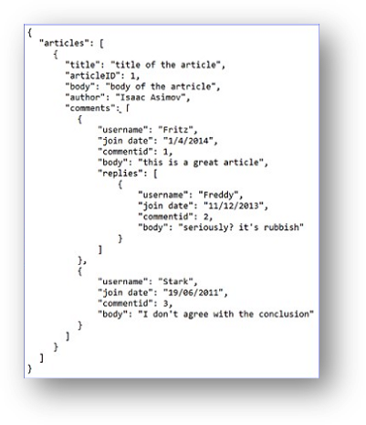

# MongoDB Basics

> *Click &#9733; if you like the project. Your contributions are heartily ♡ welcome.*

 

## Table of Contents

* *[MongoDB Commands](mongodb-commands.md)*
* *[MongoDB Coding Practice](mongodb-code.md)*

 

## Q. What are the different types of NoSQL databases?

NoSQL is a non-relational DBMS, that does not require a fixed schema, avoids joins, and is easy to scale. The purpose of using a NoSQL database is for distributed data stores with humongous data storage needs. NoSQL is used for Big data and real-time web apps.

**Types of NoSQL Databases:**

* Document databases
* Key-value stores
* Column-oriented databases
* Graph databases

**1. Document databases:**

A document database stores data in JSON, BSON , or XML documents. In a document database, documents can be nested. Particular elements can be indexed for faster querying.

Documents can be stored and retrieved in a form that is much closer to the data objects used in applications, which means less translation is required to use the data in an application. SQL data must often be assembled and disassembled when moving back and forth between applications and storage.

**Example:**  Amazon SimpleDB, CouchDB, MongoDB, Riak, Lotus Notes are popular Document originated DBMS systems.

  

