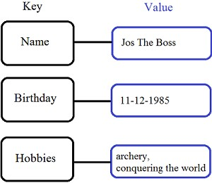
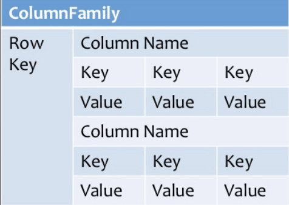
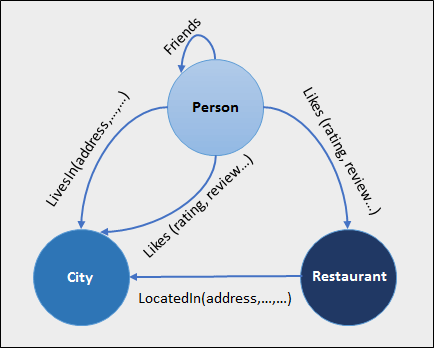
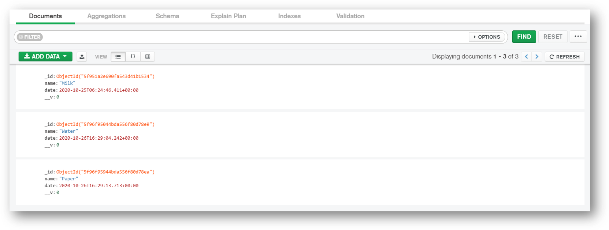
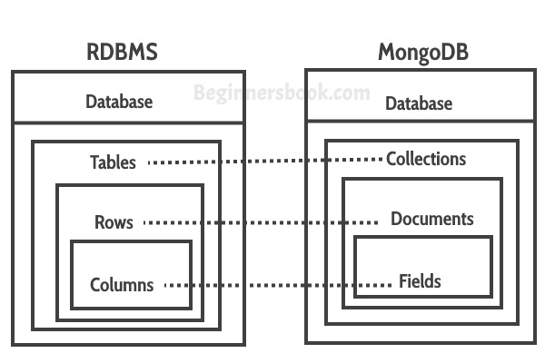

# MongoDB Basics

> *Click &#9733; if you like the project. Your contributions are heartily ♡ welcome.*

<br/>

## Table of Contents

* *[MongoDB Commands](mongodb-commands.md)*
* *[MongoDB Coding Practice](mongodb-code.md)*

<br/>

## Q. What are the different types of NoSQL databases?

NoSQL is a non-relational DBMS, that does not require a fixed schema, avoids joins, and is easy to scale. The purpose of using a NoSQL database is for distributed data stores with humongous data storage needs. NoSQL is used for Big data and real-time web apps.

**Types of NoSQL Databases:**

* Document databases
* Key-value stores
* Column-oriented databases
* Graph databases

**1. Document databases:**

A document database stores data in JSON, BSON , or XML documents. In a document database, documents can be nested. Particular elements can be indexed for faster querying.

Documents can be stored and retrieved in a form that is much closer to the data objects used in applications, which means less translation is required to use the data in an application. SQL data must often be assembled and disassembled when moving back and forth between applications and storage.

**Example:**  Amazon SimpleDB, CouchDB, MongoDB, Riak, Lotus Notes are popular Document originated DBMS systems.

<p align="center">
  
</p>

**2. Key-value Stores:**

Data is stored in key/value pairs. It is designed in such a way to handle lots of data and heavy load. Key-value pair storage databases store data as a hash table where each key is unique, and the value can be a JSON, BLOB(Binary Large Objects), string, etc.

**Example:** of key-value stores are Redis, Voldemort, Riak, and Amazon\'s DynamoDB.

<p align="center">
  
</p>

**3. Column-Oriented Databases:**

Column-oriented databases work on columns and are based on BigTable paper by Google. Every column is treated separately. The values of single column databases are stored contiguously.

They deliver high performance on aggregation queries like SUM, COUNT, AVG, MIN, etc. as the data is readily available in a column.

**Example:** Column-based NoSQL databases are widely used to manage data warehouses, business intelligence, CRM, Library card catalogs, HBase, Cassandra, HBase, Hypertable are examples of a column-based database.

<p align="center">
  
</p>

**4. Graph Databases:**

A graph type database stores entities as well the relations amongst those entities. The entity is stored as a node with the relationship as edges. An edge gives a relationship between nodes. Every node and edge has a unique identifier.

Compared to a relational database where tables are loosely connected, a Graph database is a multi-relational in nature. Traversing relationships as fast as they are already captured into the DB, and there is no need to calculate them.

Graph base databases mostly used for social networks, logistics, spatial data.

**Example:** Neo4J, Infinite Graph, OrientDB, FlockDB are some popular graph-based databases.

<p align="center">
  
</p>

<div align="right">
    <b><a href="#">↥ back to top</a></b>
</div>

## Q. What is MongoDB?

**MongoDB** is a document-oriented NoSQL database used for high volume data storage. Instead of using tables and rows as in the traditional relational databases, MongoDB makes use of collections and documents. Documents consist of key-value pairs which are the basic unit of data in MongoDB. Collections contain sets of documents and function which is the equivalent of relational database tables.

**Key Features:**

* Document Oriented and NoSQL database.
* Supports Aggregation
* Uses JSON & BSON format
* Sharding (Helps in Horizontal Scalability)
* Supports Ad Hoc Queries
* Schema Less
* Capped Collection
* Indexing (Any field in MongoDB can be indexed)
* MongoDB Replica Set (Provides high availability)
* Supports Multiple Storage Engines

**Key Components:**

**1. _id**: The `_id` field represents a unique value in the MongoDB document. The `_id` field is like the document\'s primary key. If you create a new document without an `_id` field, MongoDB will automatically create the field.

**2. Collection**:  This is a grouping of MongoDB documents. A collection is the equivalent of a table which is created in any other RDMS such as Oracle.

**3. Cursor**: This is a pointer to the result set of a query. Clients can iterate through a cursor to retrieve results.

**4. Database**: This is a container for collections like in RDMS wherein it is a container for tables. Each database gets its own set of files on the file system. A MongoDB server can store multiple databases.

**5. Document**: A record in a MongoDB collection is basically called a document. The document, in turn, will consist of field name and values.

**6. Field**: A name-value pair in a document. A document has zero or more fields. Fields are analogous to columns in relational databases.

**Example:**

Connecting MongoDB Cloud using MongoDB Compass

<p align="center">
   
</p>

**[[Read More](https://docs.mongodb.com/guides/)]**

<div align="right">
    <b><a href="#">↥ back to top</a></b>
</div>

## Q. What are Indexes in MongoDB?

Indexes support the efficient execution of queries in MongoDB. Without indexes, MongoDB must perform a collection scan, i.e. scan every document in a collection, to select those documents that match the query statement. If an appropriate index exists for a query, MongoDB can use the index to limit the number of documents it must inspect.

Indexes are special data structures that store a small portion of the collection\'s data set in an easy to traverse form. The index stores the value of a specific field or set of fields, ordered by the value of the field. The ordering of the index entries supports efficient equality matches and range-based query operations. In addition, MongoDB can return sorted results by using the ordering in the index.

**Example:**

The `createIndex()` method only creates an index if an index of the same specification does not already exist. The following example ( using Node.js ) creates a single key descending index on the name field:

```js
collection.createIndex( { name : -1 }, function(err, result) {
   console.log(result);
   callback(result);
})
```

<div align="right">
    <b><a href="#">↥ back to top</a></b>
</div>

## Q. What are the types of Indexes available in MongoDB?

MongoDB supports the following types of the index for running a query.

**1. Single Field Index:**

MongoDB supports user-defined indexes like single field index. A single field index is used to create an index on the single field of a document. With single field index, MongoDB can traverse in ascending and descending order. By default, each collection has a single field index automatically created on the `_id` field, the primary key.

**Example:**

```js
{
  "_id": 1,
  "person": { name: "Alex", surname: "K" },
  "age": 29,
  "city": "New York"
}
```

We can define, a single field index on the age field.

```js
db.people.createIndex( {age : 1} ) // creates an ascending index

db.people.createIndex( {age : -1} ) // creates a descending index
```

With this kind of index we can improve all the queries that find documents with a condition and the age field, like the following:

```js
db.people.find( { age : 20 } )
db.people.find( { name : "Alex", age : 30 } )
db.people.find( { age : { $gt : 25} } )
```

**2. Compound Index:**

A compound index is an index on multiple fields. Using the same people collection we can create a compound index combining the city and age field.

```js
db.people.createIndex( {city: 1, age: 1, person.surname: 1  } )
```

In this case, we have created a compound index where the first entry is the value of the city field, the second is the value of the age field, and the third is the person.name. All the fields here are defined in ascending order.

Queries such as the following can benefit from the index:

```js
db.people.find( { city: "Miami", age: { $gt: 50 } } )
db.people.find( { city: "Boston" } )
db.people.find( { city: "Atlanta", age: {$lt: 25}, "person.surname": "Green" } )
```

**3. Multikey Index:**

This is the index type for arrays. When creating an index on an array, MongoDB will create an index entry for every element.

**Example:**

```js
{
   "_id": 1,
   "person": { name: "John", surname: "Brown" },
   "age": 34,
   "city": "New York",
   "hobbies": [ "music", "gardening", "skiing" ]
 }
```

The multikey index can be created as:

```js
db.people.createIndex( { hobbies: 1} )
```

Queries such as these next examples will use the index:

```js
db.people.find( { hobbies: "music" } )
db.people.find( { hobbies: "music", hobbies: "gardening" } )
```

**4. Geospatial Index:**

GeoIndexes are a special index type that allows a search based on location, distance from a point and many other different features. To query geospatial data, MongoDB supports two types of indexes – `2d indexes` and `2d sphere indexes`. 2d indexes use planar geometry when returning results and 2dsphere indexes use spherical geometry to return results.

**5. Text Index:**

It is another type of index that is supported by MongoDB. Text index supports searching for string content in a collection. These index types do not store language-specific stop words (e.g. "the", "a", "or"). Text indexes restrict the words in a collection to only store root words.

**Example:**

Let\'s insert some sample documents.

```js
var entries = db.people("blogs").entries;
entries.insert( {
  title : "my blog post",
  text : "i am writing a blog. yay",
  site: "home",
  language: "english" });
entries.insert( {
  title : "my 2nd post",
  text : "this is a new blog i am typing. yay",
  site: "work",
  language: "english" });
entries.insert( {
  title : "knives are Fun",
  text : "this is a new blog i am writing. yay",
  site: "home",
  language: "english" });
```

Let\'s define create the text index.

```js
var entries = db.people("blogs").entries;
entries.ensureIndex({title: "text", text: "text"}, { weights: {
    title: 10,
    text: 5
  },
  name: "TextIndex",
  default_language: "english",
  language_override: "language" });
```

Queries such as these next examples will use the index:

```js
var entries = db.people("blogs").entries;
entries.find({$text: {$search: "blog"}, site: "home"})
```

**6. Hashed Index:**

MongoDB supports hash-based sharding and provides hashed indexes. These indexes are the hashes of the field value. Shards use hashed indexes and create a hash according to the field value to spread the writes across the sharded instances.

<div align="right">
    <b><a href="#">↥ back to top</a></b>
</div>

## Q. Explain Index Properties in MongoDB?

**1. TTL Indexes:**

TTL ( **Time To Live** ) is a special option that we can apply only to a single field index to permit the automatic deletion of documents after a certain time.

During index creation, we can define an expiration time. After that time, all the documents that are older than the expiration time will be removed from the collection. This kind of feature is very useful when we are dealing with data that don\'t need to persist in the database ( eg. `session data` ).

**Example:**

```js
db.sessionlog.createIndex( { "lastUpdateTime": 1 }, { expireAfterSeconds: 1800 } )
```

In this case, MongoDB will drop the documents from the collection automatically once half an hour (1800 seconds) has passed since the value in **lastUpdateTime** field.

**Restrictions:**

* Only single field indexes can have the TTL option
* the `_id` single field index cannot support the TTL option
* the indexed field must be a date type
* a capped collection cannot have a TTL index

**2. Partial indexes:**

A partial index is an index that contains only a subset of the values based on a filter rule. They are useful in cases where:

* The index size can be reduced
* We want to index the most relevant and used values in the query conditions
* We want to index the most selective values of a field

**Example:**

```js
db.people.createIndex(
   { "city": 1, "person.surname": 1 },
   { partialFilterExpression: { age : { $lt: 30 } } }
)
```

We have created a compound index on city and person.surname but only for the documents with age less than 30.
In order for the partial index to be used the queries must contain a condition on the age field.

```js
db.people.find( { city: "New Tork", age: { $eq: 20} } )
```

**3. Sparse indexes:**

Sparse indexes are a subset of partial indexes. A sparse index only contains elements for the documents that have the indexed field, even if it is null.

Since MongoDB is a schemaless database, the documents in a collection can have different fields, so an indexed field may not be present in some of them.

**Example:**

To create such an index use the sparse option:

```js
db.people.createIndex( { city: 1 }, { sparse: true } )
```

In this case, we are assuming there could be documents in the collection with the field city missing. Sparse indexes are based on the existence of a field in the documents and are useful to reduce the size of the index.

**4. Unique indexes:**

MongoDB can create an index as unique. An index defined this way cannot contain duplicate entries.

**Example:**

```js
db.people.createIndex( { city: 1 }, { unique: true } )
```

Uniqueness can be defined for compound indexes too.

```js
db.people.createIndex( { city: 1, person.surname: 1}, { unique: true } )
```

By default, the index on `_id` is automatically created as unique.

<div align="right">
    <b><a href="#">↥ back to top</a></b>
</div>

## Q. How many indexes does MongoDB create by default for a new collection?

By default MongoDB creates a unique index on the `_id` field during the creation of a collection. The `_id` index prevents clients from inserting two documents with the same value for the `_id` field.

<div align="right">
    <b><a href="#">↥ back to top</a></b>
</div>

## Q. Can you create an index in an array field in MongoDB?

Yes, To index a field that holds an array value, MongoDB creates an index key for each element in the array. Multikey indexes can be constructed over arrays that hold both scalar values (e.g. strings, numbers) and nested documents. MongoDB automatically creates a multikey index if any indexed field is an array.

**Syntax:**

```js
db.collection.createIndex( { <field>: < 1 or -1 > } )
```

For example, consider an inventory collection that contains the following documents:

```js
{ _id: 10, type: "food", item: "aaa", ratings: [ 5, 8, 9 ] }
{ _id: 11, type: "food", item: "bbb", ratings: [ 5, 9 ] }
{ _id: 12, type: "food", item: "ccc", ratings: [ 9, 5, 8, 4, 7 ] }
```

The collection has a multikey index on the ratings field:

```js
db.inventory.createIndex( { ratings: 1 } )
```

The following query looks for documents where the ratings field is the array [ 5, 9 ]:

```js
db.inventory.find( { ratings: [ 5, 9 ] } )
```

MongoDB can use the multikey index to find documents that have 5 at any position in the ratings array. Then, MongoDB retrieves these documents and filters for documents whose ratings array equals the query array [ 5, 9 ].

<div align="right">
    <b><a href="#">↥ back to top</a></b>
</div>

## Q. How to remove attribute from MongoDB Object?

**$unset:**

The `$unset` operator deletes a particular field. If the field does not exist, then `$unset` does nothing. When used with `$` to match an array element, `$unset` replaces the matching element with `null` rather than removing the matching element from the array. This behavior keeps consistent the array size and element positions.

syntax:

```js
{ $unset: { <field1>: "", ... } }
```

**Example:**

delete the `properties.service` attribute from all records on this collection.

```js
db.collection.update(
    {},
    {
        $unset : {
            "properties.service" : 1
        }
    },
    {
        multi: true
    }
);
```

**To verify they have been deleted you can use:**

```js
db.collection.find(
    {
        "properties.service" : {
            $exists : true
         }
    }
).count(true);
```

<div align="right">
    <b><a href="#">↥ back to top</a></b>
</div>

## Q. What is "Namespace" in MongoDB?

MongoDB stores BSON (Binary Interchange and Structure Object Notation) objects in the collection. The concatenation of the collection name and database name is called a namespace

<div align="right">
    <b><a href="#">↥ back to top</a></b>
</div>

## Q. What is Replication in Mongodb?

Replication exists primarily to offer data redundancy and high availability. It maintain the durability of data by keeping multiple copies or replicas of that data on physically isolated servers. Replication allows to increase data availability by creating multiple copies of data across servers. This is especially useful if a server crashes or hardware failure.

With MongoDB, replication is achieved through a **Replica Set**. Writer operations are sent to the primary server (node), which applies the operations across secondary servers, replicating the data. If the primary server fails (through a crash or system failure), one of the secondary servers takes over and becomes the new primary node via election. If that server comes back online, it becomes a secondary once it fully recovers, aiding the new primary node.

<div align="right">
    <b><a href="#">↥ back to top</a></b>
</div>

## Q. What is Replica Set in MongoDB?

It is a group of mongo processes that maintain same data set. Replica sets provide redundancy and high availability, and are the basis for all production deployments. A replica set contains a primary node and multiple secondary nodes.

The primary node receives all write operations. A replica set can have only one primary capable of confirming writes with `{ w: "majority" }` write concern; although in some circumstances, another mongod instance may transiently believe itself to also be primary.

The secondaries replicate the primary\'s oplog and apply the operations to their data sets such that the secondaries\' data sets reflect the primary\'s data set. If the primary is unavailable, an eligible secondary will hold an election to elect itself the new primary.

<p align="center">
  
</p>

<div align="right">
    <b><a href="#">↥ back to top</a></b>
</div>

## Q. How does MongoDB ensure high availability?

**High Availability (HA)** refers to the improvement of system and app availability by minimizing the downtime caused by routine maintenance operations (planned) and sudden system crashes (unplanned).

**Replica Set:**

The replica set mechanism of MongoDB has two main purposes:

* One is for data redundancy for failure recovery. When the hardware fails, or the node is down for other reasons, you can use a replica for recovery.
* The other purpose is for read-write splitting. It routes the reading requests to the replica to reduce the reading pressure on the primary node.

MongoDB automatically maintains replica sets, multiple copies of data that are distributed across servers, racks and data centers. Replica sets help prevent database downtime using native replication and automatic failover.

A replica set consists of multiple replica set members. At any given time, one member acts as the primary member, and the other members act as secondary members. If the primary member fails for any reason (e.g., hardware failure), one of the secondary members is automatically elected to primary and begins to process all reads and writes.

<div align="right">
    <b><a href="#">↥ back to top</a></b>
</div>

## Q. What is an Embedded MongoDB Document?

An embedded, or nested, MongoDB Document is a normal document that is nested inside another document within a MongoDB collection. Embedding connected data in a single document can reduce the number of read operations required to obtain data. In general, we should structure our schema so that application receives all of its required information in a single read operation.

**Example:**

In the normalized data model, the address documents contain a reference to the patron document.

```js
// patron document
{
   _id: "joe",
   name: "Joe Bookreader"
}

// address documents
{
   patron_id: "joe", // reference to patron document
   street: "123 Fake Street",
   city: "Faketon",
   state: "MA",
   zip: "12345"
}

{
   patron_id: "joe",
   street: "1 Some Other Street",
   city: "Boston",
   state: "MA",
   zip: "12345"
}
```

Embedded documents are particularly useful when a **one-to-many** relationship exists between documents. In the example shown above, we see that a single customer has multiple addresses associated with him. The nested document structure makes it easy to retrieve complete address information about this customer with just a single query.

<div align="right">
    <b><a href="#">↥ back to top</a></b>
</div>

## Q. How can you achieve primary key - foreign key relationships in MongoDB?

The primary key-foreign key relationship can be achieved by embedding one document inside the another. As an example, a department document can have its employee document(s).

<div align="right">
    <b><a href="#">↥ back to top</a></b>
</div>

## Q. When should we embed one document within another in MongoDB?

You should consider embedding documents for:

* *contains* relationships between entities
* One-to-many relationships
* Performance reasons

<div align="right">
    <b><a href="#">↥ back to top</a></b>
</div>

## Q. How is data stored in MongoDB?

In MongoDB, Data is stored in BSON documents (short for `Bin­ary JSON`). These documents are stored in MongoDB in JSON (JavaScript Object Notation) format. JSON documents support embedded fields, so related data and lists of data can be stored with the document instead of an external table. Documents contain one or more fields, and each field contains a value of a specific data type, including arrays, binary data and sub-documents. Documents that tend to share a similar structure are organized as collections.

JSON is formatted as name/value pairs. In JSON documents, field names and values are separated by a colon, field name and value pairs are separated by commas, and sets of fields are encapsulated in "curly braces" ({}).

**Example:**

```js
{
  "name": "notebook",
  "qty": 50,
  "rating": [ { "score": 8 }, { "score": 9 } ],
  "size": { "height": 11, "width": 8.5, "unit": "in" },
  "status": "A",
  "tags": [ "college-ruled", "perforated"]
}
```

<div align="right">
    <b><a href="#">↥ back to top</a></b>
</div>

## Q. What are the differences between MongoDB and SQL-SERVER?

* The MongoDB store the data in documents with JSON format but SQL store the data in Table format.
* The MongoDB provides high performance, high availability, easy scalability etc.  rather than SQL Server.
* In the MongoDB, we can change the structure simply by adding, removing column from the existing documents.

**MongoDB and SQL Server Comparision Table:**

|Base of Comparison  | MS SQL Server      | MongoDB             |
|--------------------|--------------------|---------------------|
|Storage Model       |RDBMS               |Document-Oriented    |
|Joins               |Yes                 |No                   |
|Transaction         |ACID                |Multi-document ACID Transactions with snapshot isolation |
|Agile practices     |No                  |Yes                  |
|Data Schema         |Fixed               |Dynamic              |
|Scalability         |Vertical            |Horizontal           |
|Map Reduce          |No                  |Yes                  |
|Language            |SQL query language  |JSON Query Language  |
|Secondary index     |Yes                 |Yes                  |
|Triggers            |Yes                 |Yes                  |
|Foreign Keys        |Yes                 |No                   |
|Concurrency         |Yes                 |yes                  |
|XML Support         |Yes                 |No                   |

<p align="center">
  
</p>

<div align="right">
    <b><a href="#">↥ back to top</a></b>
</div>